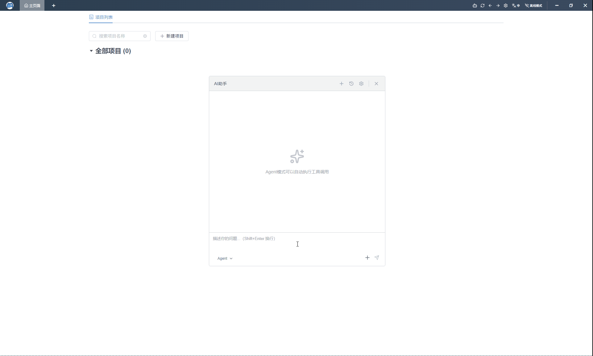

<div align="center">


# Apiflow

### Postman / Apifox 开源替代方案

[English](./README.md) | 中文

[](https://github.com/trueleaf/apiflow/releases/latest)
[](https://github.com/trueleaf/apiflow/blob/master/LICENSE)
[](https://github.com/trueleaf/apiflow/releases/latest)

[下载](https://github.com/trueleaf/apiflow/releases) | [在线演Demo](https://apiflow.cn/)


</div>

---

## 界面预览

### Agent展示


### SSE与MOCK展示


---

## Apiflow 是什么？

**Apiflow** 是一个 **完全免费**、**内置 AI 能力** 的 API 接口工具，致力于成为**Postman、Apifox 的现代化开源替代方案**。

它集成了 **API 测试、Mock、WebSocket、AI Agent、团队协作、离线使用、本地部署** 等能力，并全面拥抱 **OpenAPI 3.0 生态体系**。

---

## 核心特性

### 完全免费
- 所有功能永久免费
- 无付费计划
- 无功能限制
- 一键导出到postman、apifox等工具

### 内置 AI Agent
- 内置 AI Agent，辅助 API 设计、测试与调试
- 支持配置你自己的大语言模型（LLM）
- 支持 **离线 / 内网环境** 使用

### 团队协作
- 内置团队与工作区管理
- **团队数量、成员数量不限**
- 细粒度权限控制：
  - 项目级权限
  - 基于角色的权限管理（RBAC）
  - 只读 / 编辑 / 管理员角色
- 操作记录与变更历史追踪
- 适用于任何规模的团队

### 离线 & 在线
- Local-First 设计理念
- 完整离线能力，本地数据持久化
- 离线 / 在线数据双向转换
- 从个人使用平滑过渡到团队协作
- 非常适合内网或受限网络环境

### 自托管 & 本地部署
- Docker 一键部署
- 数据完全由自己掌控
- 适用于企业私有化部署场景

### OpenAPI 友好
- 支持 **OpenAPI 3.x** 导入 / 导出
- 可无缝迁移到：
  - Postman
  - Insomnia
  - Hoppscotch
  - 任意 OpenAPI 兼容工具

---

## 核心能力一览

- HTTP API 测试（RESTful）
- WebSocket 测试
- Mock Server（HTTP / WebSocket / SSE）
- 环境变量与变量系统
- 请求前 / 请求后脚本
- 项目与文件夹管理
- 导入 / 导出（Postman / OpenAPI / JSON）
- 国际化支持（英文 / 中文 / 日文）

---

## ⬇️ 下载

获取适用于你平台的最新版本：

| 平台 | 下载地址 |
|------|----------|
| Windows | https://github.com/trueleaf/apiflow/releases |
| macOS | https://github.com/trueleaf/apiflow/releases |
| Linux | https://github.com/trueleaf/apiflow/releases |

---

## 本地部署（Docker）

### 环境要求
- Docker
- Docker Compose

### 首次部署

```bash
git clone https://gitee.com/wildsell/apiflow
cd apiflow

cp .env.example .env
# 编辑 .env，配置 MongoDB 等参数

docker compose -f docker-compose.yml -f docker-compose.cn.yml pull
docker compose -f docker-compose.yml -f docker-compose.cn.yml up -d

# 验证部署
curl http://localhost
curl http://localhost/api/health
```

### 部署后添加用户

部署成功后,按照以下步骤添加用户:

1. **切换到互联网模式**
   - 点击应用中的网络模式切换按钮(通常在右上角)
   - 选择"互联网模式"以启用在线功能

2. **登录管理员账号**
   - 账号: `admin`
   - 默认密码: `111111`
   - **重要提示**: 首次登录后请立即修改默认密码以确保安全

3. **添加新用户**
   - 进入后台管理系统
   - 找到用户管理模块
   - 点击"添加用户"为团队成员创建新账号

### 代码更新

如果你是通过 Docker 运行 Apiflow，更新代码时无需在本地重新构建。

**方式一：使用更新脚本（推荐）**

```bash
# 添加执行权限（首次）
chmod +x update.sh rollback.sh

# 执行更新
./update.sh --cn
```

**方式二：手动更新**

```bash
docker compose -f docker-compose.yml -f docker-compose.cn.yml down
docker compose -f docker-compose.yml -f docker-compose.cn.yml pull
docker compose -f docker-compose.yml -f docker-compose.cn.yml up -d
```

**回滚（推荐使用快照精确回滚）**

```bash
# 方式一：回滚到最近一次 update.sh 备份的快照（推荐）
./rollback.sh --previous

# 方式二：回滚到指定快照文件（推荐）
./rollback.sh --file current_versions_20260122_120000.txt

# 方式三：兼容模式，按 tag/sha 回滚（不保证精确，适合紧急）
./rollback.sh v1.2.3
# ./rollback.sh 7f3a2b1c4d5e

# 中国镜像源配置（如需）
./rollback.sh --previous --cn
```

---

## 阿里云部署(2026-01-22更新)

### 购买服务器


### linux部署
直接在服务器运行以下命令,完成后浏览器通过ip直接访问。注意：mongodb密码需要你自行修改
```bash
#添加Docker软件包源
sudo wget -O /etc/yum.repos.d/docker-ce.repo http://mirrors.cloud.aliyuncs.com/docker-ce/linux/centos/docker-ce.repo
sudo sed -i 's|https://mirrors.aliyun.com|http://mirrors.cloud.aliyuncs.com|g' /etc/yum.repos.d/docker-ce.repo
#Alibaba Cloud Linux3专用的dnf源兼容插件
sudo dnf -y install dnf-plugin-releasever-adapter --repo alinux3-plus
#安装Docker社区版本，容器运行时containerd.io，以及Docker构建和Compose插件
sudo dnf -y install docker-ce docker-ce-cli containerd.io docker-buildx-plugin docker-compose-plugin

#启动Docker
sudo systemctl start docker
#设置Docker守护进程在系统启动时自动启动
sudo systemctl enable docker

yum install -y git
git clone https://gitee.com/wildsell/apiflow.git
cd apiflow
cat > .env << 'EOF'
MONGO_ROOT_USERNAME=admin
MONGO_ROOT_PASSWORD=9sf9383jm8dpqbxxaaxs
MONGO_DATABASE=apiflow
EOF

docker compose -f docker-compose.yml -f docker-compose.cn.yml pull
docker compose -f docker-compose.yml -f docker-compose.cn.yml up -d
curl -i localhost
```


### 环境要求
- 2核心2G内存


## 本地开发

### 环境要求
- **Node.js**: >= 20.0.0
- **MongoDB**: 本地运行或远程可访问
- **Git**: 用于克隆代码仓库

### 快速开始

1. **克隆代码仓库**

```bash
git clone https://gitee.com/wildsell/apiflow.git
cd apiflow
#安装依赖
npm install
```
**国内用户加速安装**

如果你在国内环境下遇到依赖安装缓慢的问题，可以启用国内镜像源：

编辑项目根目录的 `.npmrc` 文件，取消以下三行的注释（删除行首的 `#` 符号）：

```properties
ELECTRON_MIRROR=https://npmmirror.com/mirrors/electron/
ELECTRON_BUILDER_BINARIES_MIRROR=https://npmmirror.com/mirrors/electron-builder-binaries/
registry=https://registry.npmmirror.com
```

然后重新运行 `npm install`。

2. **启动开发服务器**

```bash
npm run dev
```

此命令会同时启动前端和后端开发服务器：
- **前端 (Web)**: http://localhost:4000
- **后端 (Server)**: http://localhost:7001

### 可用命令

| 命令 | 说明 |
|------|------|
| `npm run dev` | 同时启动前端和后端开发服务器 |
| `npm run dev:web` | 仅启动前端开发服务器 |
| `npm run web:dev` | 仅启动前端开发服务器（备用） |
| `npm run server:dev` | 仅启动后端开发服务器 |
| `npm run web:build` | 构建 Web 应用 |
| `npm run server:build` | 构建 Server 应用 |
| `npm run server:test` | 运行后端单元测试 |
| `npm run bootstrap` | 安装所有依赖 |

### 项目结构

这是一个多包项目（monorepo）：

- `packages/web` - 前端应用（Vite + Vue 3 + Electron）
- `packages/server` - 后端应用（Midway.js + MongoDB）
- `packages/website` - 官网（Next.js）

### 开发提示

- 启动 Server 前请确保 MongoDB 已运行
- 前端支持热模块替换（HMR），可快速开发调试
- 后端文件变更时会自动重启
- 可以通过运行特定命令独立开发各个包

---

## 本地打包（Electron）

如需将应用打包为桌面安装包，可在项目根目录执行以下命令。

### 环境要求
- **Node.js**: >= 20.0.0
- **macOS**：需安装 Xcode Command Line Tools（`xcode-select --install`）
- **Linux**：如需构建 `.deb` 包需安装 `fakeroot`、`dpkg`；构建 `.rpm` 需安装 `rpm`
- Windows / macOS / Linux 安装包只能在对应平台上构建（不支持跨平台交叉编译）

### 打包命令

| 命令 | 说明 |
|------|------|
| `npm run web:build:local:pack` | 快速验证：仅解压到目录，不生成安装包，速度最快 |
| `npm run web:build:local:win` | 构建 Windows 安装包（`.exe` NSIS 安装程序） |
| `npm run web:build:local:mac` | 构建 macOS 安装包（`.dmg` + `.zip`，支持 x64/arm64） |
| `npm run web:build:local:linux` | 构建 Linux 安装包（`.AppImage` + `.deb`，支持 x64/arm64） |

### 输出目录

打包产物位于 `packages/web/release/` 目录下。

### 国内加速

如在国内环境下下载 Electron 相关二进制文件缓慢，可在项目根目录 `.npmrc` 文件中取消以下两行的注释：

```properties
ELECTRON_MIRROR=https://npmmirror.com/mirrors/electron/
ELECTRON_BUILDER_BINARIES_MIRROR=https://npmmirror.com/mirrors/electron-builder-binaries/
```

---

## 许可证

本项目采用 **MIT** 许可证进行许可

详情请参阅 [LICENSE](./LICENSE)
